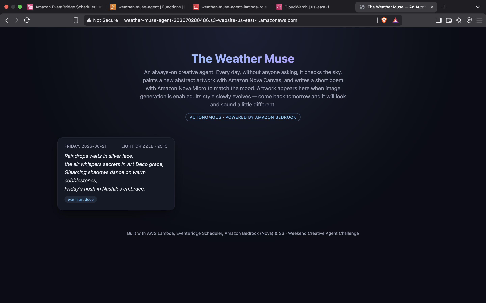
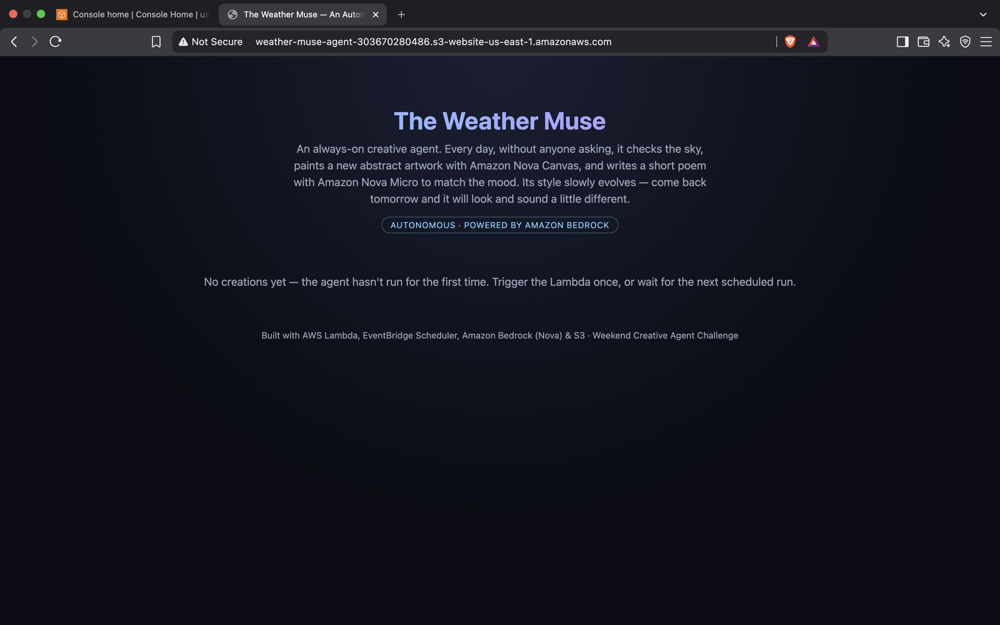
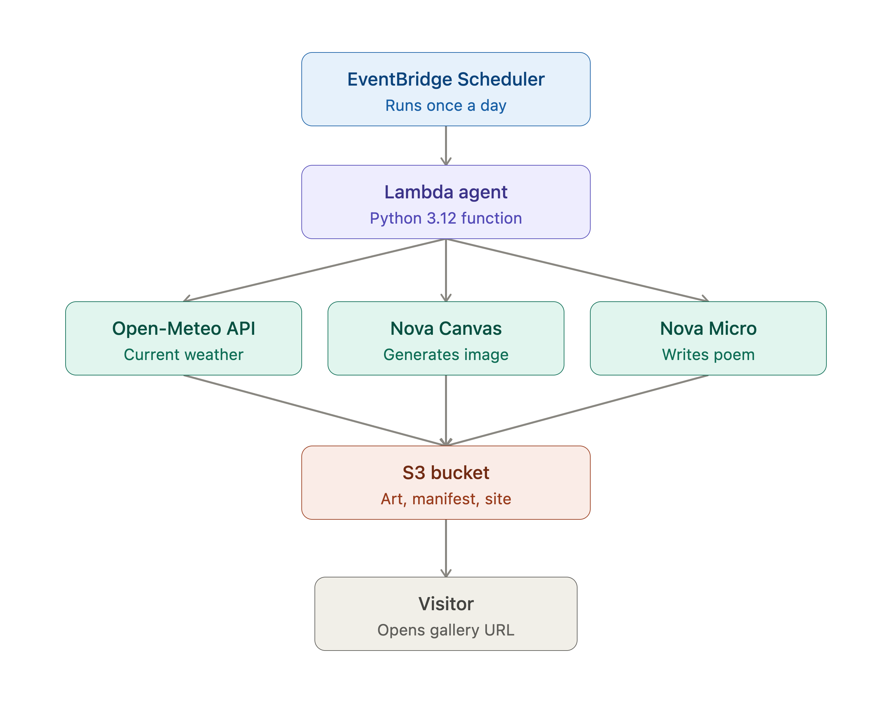
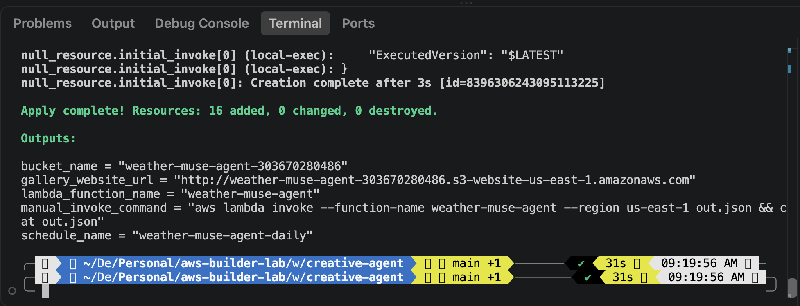

# The Weather Muse — An Always-On Creative Agent

> A serverless agent that wakes up once a day, looks at the sky over Nashik, and
> writes a poem about it. Nobody asks it to. Nobody opens it. It just keeps
> making things.

Built for the **AWS Builder Center Weekend Challenge: _Set Your Creative App Free_** —
a challenge to build something that creates on its own, with no human in the loop.

**Live gallery:** http://weather-muse-agent-303670280486.s3-website-us-east-1.amazonaws.com



---

## Table of Contents

- [What It Does](#what-it-does)
- [Architecture](#architecture)
- [Repository Layout](#repository-layout)
- [Prerequisites](#prerequisites)
- [Deploy](#deploy)
- [Configuration](#configuration)
- [Terraform Outputs](#terraform-outputs)
- [How the Agent Thinks](#how-the-agent-thinks)
- [Image Generation (Opt-In)](#image-generation-opt-in)
- [Cost](#cost)
- [Operating the Agent](#operating-the-agent)
- [Troubleshooting](#troubleshooting)
- [Teardown](#teardown)
- [Notes for the Builder Center Submission](#notes-for-the-builder-center-submission)

---

## What It Does

Every day, on a schedule, with no human involved:

1. **Checks the weather** — current temperature and conditions for a fixed
   latitude/longitude via the free, key-less [Open-Meteo](https://open-meteo.com/)
   API. WMO weather codes are mapped to human phrases like *"light drizzle"*.
2. **Advances its style** — rotates one step through eight artistic
   sensibilities, so its creative "voice" drifts over time:

   `soft watercolor → vibrant ukiyo-e woodblock → moody cyberpunk neon → warm art deco → dreamy impressionist → retro pixel art → cosmic surrealism → minimalist ink wash → ↻`

3. **Writes a poem** — asks **Amazon Nova Micro** (Bedrock) for a four-line
   free-verse poem tying together today's weather, the day of the week, the
   location, and the currently active style.
4. **Paints an artwork** *(optional, off by default — see
   [Image Generation](#image-generation-opt-in))*.
5. **Publishes itself** — writes the entry to `manifest.json` in S3. A static
   gallery page reads that manifest and renders the growing collection.

The result is a tool you never have to open. It accumulates whether or not
anyone is watching.

### The gallery before and after its first run

The site deploys empty, then fills itself in:

| Before the first run | After a run |
| --- | --- |
|  |  |

Each card carries the date and day, the weather that inspired it, the poem
itself, and a tag showing which style was active. Artwork sits above the text
when image generation is switched on.

---

## Architecture



> **Note:** the diagram labels the image model as *Nova Canvas*, which is how
> this project started. Nova Canvas has since been retired by AWS (`LEGACY`),
> and the image path now targets a Stability model that is disabled by default.
> The text path (Nova Micro) and every other box is accurate. See
> [Image Generation](#image-generation-opt-in) for the full story.

```
 EventBridge Scheduler  (rate: 1 day, UTC)
        │  invokes
        ▼
   AWS Lambda  (Python 3.12, 512 MB, 60 s timeout)
        │
        ├──► Open-Meteo API                             current weather (no key)
        ├──► Amazon Bedrock: Nova Micro      us-east-1   poem         (always on)
        └──► Amazon Bedrock: Stable Image Core us-west-2 artwork      (opt-in)
        │
        ▼
   S3 bucket  (static website hosting, public read)
        ├── index.html            gallery UI
        ├── manifest.json         rolling list, last 30 entries
        ├── state.json            style rotation counter
        └── art/YYYY-MM-DD.png    artwork, when enabled
        │
        ▼
      Visitor opens the gallery URL
```

Everything is provisioned by Terraform — **16 resources**, no servers to manage.

Why the two Bedrock calls land in different regions: the poem model runs in the
Lambda's own region, while the image model gets its own `bedrock-runtime` client
pinned to `us-west-2`, because Bedrock does not offer an active text-to-image
model in every region.

### Resources created

| Category | Resources |
| --- | --- |
| Storage & hosting | S3 bucket, public access block, website configuration, bucket policy, seeded `index.html` / `manifest.json` / `state.json` |
| Compute | Lambda function, `archive_file` (zips `lambda/`), CloudWatch log group |
| Scheduling | EventBridge schedule, Lambda invoke permission |
| Identity | Lambda execution role + policy, Scheduler role + policy |
| Bootstrap | `null_resource.initial_invoke` — one invoke after deploy so the gallery isn't empty |

---

## Repository Layout

```
creative-agent/
├── README.md               this file
├── article-draft.md        write-up draft for the challenge submission
├── versions.tf             Terraform + provider version constraints
├── variables.tf            all tunables (see Configuration)
├── main.tf                 every resource
├── outputs.tf              URLs, names, handy commands
├── lambda/
│   └── index.py            the agent itself — weather, poem, artwork, S3
├── site/
│   └── index.html          static gallery, fetches manifest.json
└── assets/                 screenshots and diagram used by this README
```

---

## Prerequisites

1. **An AWS account.** Lambda, S3, EventBridge Scheduler and CloudWatch Logs
   usage here sits comfortably inside the Free Tier. Bedrock is billed per
   request — see [Cost](#cost).

2. **Bedrock model access for the poem model.** One-time, per account and
   region, usually instant:
   *AWS Console → Amazon Bedrock → Model access* → request access to
   **Amazon Nova Micro** in your deploy region (default `us-east-1`).

   That is all the default poem-only configuration needs.

3. **[Terraform](https://developer.hashicorp.com/terraform/install) >= 1.5.0**

4. **AWS CLI configured** (`aws configure`) with credentials able to create
   IAM roles, Lambda functions, S3 buckets, and EventBridge schedules.

> **Heads-up on regions:** if you deploy somewhere other than `us-east-1`,
> check that `amazon.nova-micro-v1:0` supports on-demand throughput there. In
> some regions (for example `ap-south-1`) it is reachable only through an
> inference profile, and you would need the `us.`-prefixed model ID instead.

---

## Deploy

```bash
cd weekend-challenges/creative-agent
terraform init
terraform apply
```

Review the plan and type `yes`. On `us-east-1` with defaults you don't need to
pass any variables — it deploys out of the box.

Terraform will:

- Create the S3 gallery bucket and upload the site
- Create the Lambda function and its IAM role
- Create the EventBridge schedule (runs daily, autonomously, forever)
- Invoke the Lambda once immediately, so the gallery already has today's
  creation for screenshots — disable with `-var trigger_initial_run=false`



When it finishes, open the `gallery_website_url` output in your browser.

### Updating the agent later

You do **not** need to update the Lambda separately. `main.tf` ties the
function's `source_code_hash` to a zip of `lambda/`:

```hcl
data "archive_file" "lambda_zip" {
  type        = "zip"
  source_dir  = "${path.module}/lambda"
  output_path = "${path.module}/build/lambda.zip"
}

filename         = data.archive_file.lambda_zip.output_path
source_code_hash = data.archive_file.lambda_zip.output_base64sha256
```

Edit anything under `lambda/`, run `terraform apply`, and the hash changes so
Terraform pushes the new code automatically. If `terraform plan` reports no
change to the function, the deployed code is already current.

---

## Configuration

All values live in [`variables.tf`](variables.tf). Override with `-var`, a
`*.tfvars` file, or by editing the defaults.

| Variable | Default | Purpose |
| --- | --- | --- |
| `aws_region` | `us-east-1` | Region for every resource and the poem model. |
| `project_name` | `weather-muse-agent` | Prefix for all resource names. |
| `location_name` | `Nashik` | Place name woven into the poems. |
| `latitude` | `19.9975` | Latitude for the weather lookup. |
| `longitude` | `73.7898` | Longitude for the weather lookup. |
| `enable_image_generation` | `false` | Generate artwork alongside the poem. Needs a paid Marketplace subscription. |
| `image_model_id` | `stability.stable-image-core-v1:1` | Bedrock text-to-image model. |
| `image_model_region` | `us-west-2` | Region for the image model — deliberately separate from `aws_region`. |
| `image_aspect_ratio` | `1:1` | Artwork ratio. Stability models take a ratio, not pixel dimensions. |
| `text_model_id` | `amazon.nova-micro-v1:0` | Bedrock model for the poem. |
| `schedule_expression` | `rate(1 day)` | How often the agent runs autonomously. |
| `trigger_initial_run` | `true` | Invoke once right after deploy so the gallery isn't empty. |
| `log_retention_days` | `14` | CloudWatch Logs retention. |

### Making it your own

Point it at your own sky:

```bash
terraform apply \
  -var location_name="Lisbon" \
  -var latitude="38.7223" \
  -var longitude="-9.1393"
```

Or let it create more often:

```bash
terraform apply -var schedule_expression="rate(6 hours)"
```

The manifest keeps the **most recent 30 entries**, and re-running on the same
day replaces that day's entry rather than duplicating it — so a manual test
invoke won't clutter the gallery.

---

## Terraform Outputs

| Output | What it gives you |
| --- | --- |
| `gallery_website_url` | Public URL of the gallery. |
| `bucket_name` | S3 bucket holding art, poems and the site. |
| `lambda_function_name` | For manual invokes and log tailing. |
| `schedule_name` | The EventBridge schedule driving autonomous runs. |
| `manual_invoke_command` | Ready-to-paste CLI command to trigger a run. |

---

## How the Agent Thinks

[`lambda/index.py`](lambda/index.py) is deliberately small and
dependency-free — just `boto3` and the standard library.

| Function | Role |
| --- | --- |
| `get_weather()` | Open-Meteo current conditions; maps WMO codes to readable phrases. |
| `get_state()` / `save_state()` | Persists the style rotation counter in `state.json`. |
| `get_manifest()` / `save_manifest()` | Reads and writes the rolling gallery index. |
| `generate_poem()` | Nova Micro via `bedrock.converse`, `temperature=0.9` for variety. |
| `generate_image()` | Stability text-to-image via `invoke_model`; guarded by the feature flag. |
| `handler()` | Orchestrates the run and writes results to S3. |

**Statefulness is the point.** Because the style index lives in S3 rather than
in memory, the agent's aesthetic genuinely evolves across invocations. Day one
is watercolor; a week later it is thinking in cosmic surrealism.

A poem it produced on a drizzly Friday in Nashik, during its *warm art deco*
phase:

> Raindrops waltz in silver lace,
> the air whispers secrets in Art Deco grace,
> Gleaming shadows dance on warm cobblestones,
> Friday's hush in Nashik's embrace.

---

## Image Generation (Opt-In)

Artwork is **disabled by default** (`enable_image_generation = false`). That is
not an oversight — it reflects a real constraint in Bedrock's current model
lineup.

### Why it's off

- **Nova Canvas is retired.** `amazon.nova-canvas-v1:0` — the one Amazon-native
  text-to-image model, and what this project originally used — is now marked
  `LEGACY`. It refuses callers who haven't used it in the previous 30 days:

  ```
  ResourceNotFoundException: This Model is marked by provider as Legacy and you
  have not been actively using the model in the last 30 days.
  ```

- **Every remaining option is third-party.** All active Bedrock text-to-image
  models are Stability models sold through **AWS Marketplace**, which requires a
  valid payment instrument on the account. Without one, the first invocation may
  succeed and every subsequent one fails:

  ```
  AccessDeniedException: Model access is denied due to INVALID_PAYMENT_INSTRUMENT
  ```

  That single initial success is misleading — always verify with **two
  consecutive** invocations.

- **Availability metadata can't be trusted on its own.**
  `get-foundation-model-availability` has been observed reporting
  `NOT_AVAILABLE` for models that invoke fine, and `AVAILABLE` for models that
  refuse. Test with a real `invoke_model` call.

So the agent degrades gracefully: the poem is the guaranteed daily artifact, and
artwork is a bonus when billing allows it. The gallery renders poem-only cards
cleanly rather than showing broken images.

### Turning it on

1. Ensure a **valid payment method** is on the account
   (*Billing and Cost Management → Payment preferences*).
2. Enable the model in *Bedrock → Model access* for your `image_model_region`.
3. Verify it **twice** from the CLI:

   ```bash
   aws bedrock-runtime invoke-model --region us-west-2 \
     --model-id stability.stable-image-core-v1:1 \
     --body '{"prompt":"test","mode":"text-to-image","aspect_ratio":"1:1","output_format":"png"}' \
     --cli-binary-format raw-in-base64-out /tmp/test.json
   ```

4. Deploy with the flag on:

   ```bash
   terraform apply -var enable_image_generation=true
   ```

Available image models, cheapest first:

| Model | Price per image |
| --- | --- |
| `stability.stable-image-core-v1:1` | $0.04 |
| `stability.sd3-5-large-v1:0` | $0.08 |
| `stability.stable-image-ultra-v1:1` | $0.14 |

---

## Cost

Running poem-only, on the daily schedule:

| Service | Usage | Cost |
| --- | --- | --- |
| Lambda | ~30 invocations/month, a few seconds each | Free Tier |
| S3 | Kilobytes of JSON plus a small HTML page | Free Tier / cents |
| EventBridge Scheduler | 30 invocations/month | Free Tier |
| CloudWatch Logs | 14-day retention, tiny volume | Free Tier / cents |
| Bedrock — Nova Micro | ~30 short completions/month | Fractions of a cent |

**Effectively free.** Enabling artwork adds roughly **$1.20/month** at
$0.04/image once a day.

---

## Operating the Agent

**Trigger a run on demand:**

```bash
aws lambda invoke --function-name weather-muse-agent --region us-east-1 out.json && cat out.json
```

A healthy poem-only response:

```json
{"date": "2026-08-21", "image": null, "style": "warm art deco", "imageEnabled": false}
```

**Tail the logs:**

```bash
aws logs tail /aws/lambda/weather-muse-agent --region us-east-1 --follow
```

**Inspect what it has made:**

```bash
aws s3 cp s3://weather-muse-agent-303670280486/manifest.json - | python3 -m json.tool
```

**Pause it** without tearing anything down:

```bash
terraform apply -var schedule_expression="rate(365 days)"
```

---

## Troubleshooting

| Symptom | Cause and fix |
| --- | --- |
| `INVALID_PAYMENT_INSTRUMENT` | No valid payment method for the Marketplace image model. Fix billing, or run poem-only with `enable_image_generation=false`. |
| `ResourceNotFoundException ... marked by provider as Legacy` | You're pointing at Nova Canvas, which is retired. Use a Stability model, or keep artwork off. |
| `Invocation of model ID ... with on-demand throughput isn't supported` | That model needs an inference profile in your region. Use the `us.`-prefixed ID, or deploy to `us-east-1`. |
| Gallery shows "No creations yet" | The agent hasn't run. Invoke it manually, or check `trigger_initial_run`. |
| Gallery looks stale | `manifest.json` is served with `Cache-Control: no-cache`, but try a hard refresh. |
| An image model worked once, then stopped | Classic Marketplace symptom — the first call is optimistic. Confirm with two consecutive invocations. |
| Lambda code changes didn't deploy | They deploy via `source_code_hash`. Check `terraform plan`; no diff means the running code is already current. |
| Anything else | `CloudWatch Logs → /aws/lambda/weather-muse-agent` — most commonly Bedrock model access not yet granted in that region. |

---

## Teardown

The bucket does **not** set `force_destroy`, and the agent writes objects
Terraform doesn't track (`art/*.png`, plus its own rewrites of `manifest.json`
and `state.json`). So a plain `terraform destroy` fails on the non-empty bucket
with `BucketNotEmpty`.

Save anything worth keeping, empty the bucket, then destroy:

```bash
# 1. back up what the agent made
aws s3 sync s3://weather-muse-agent-303670280486 ./muse-backup

# 2. empty the bucket
aws s3 rm s3://weather-muse-agent-303670280486 --recursive

# 3. tear down
terraform destroy
```

To skip the manual step on future deployments, add `force_destroy = true` to the
`aws_s3_bucket.gallery` resource in [`main.tf`](main.tf) — with the usual caveat
that `terraform destroy` will then silently delete every generated poem and
artwork.

---