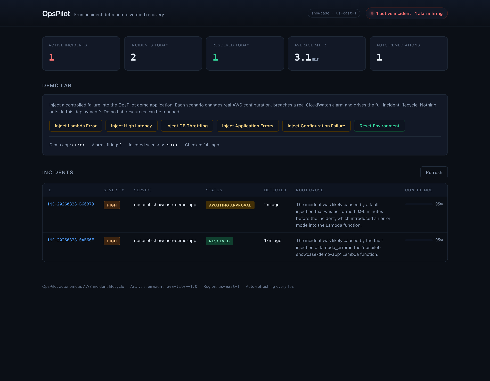
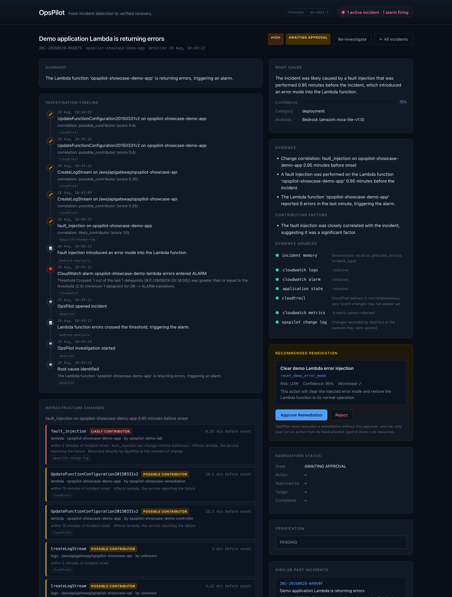
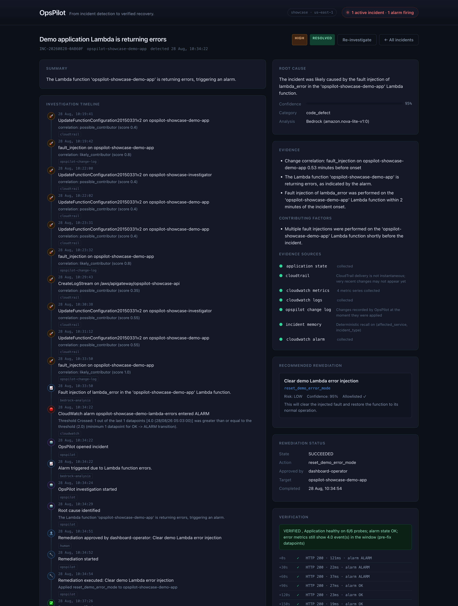
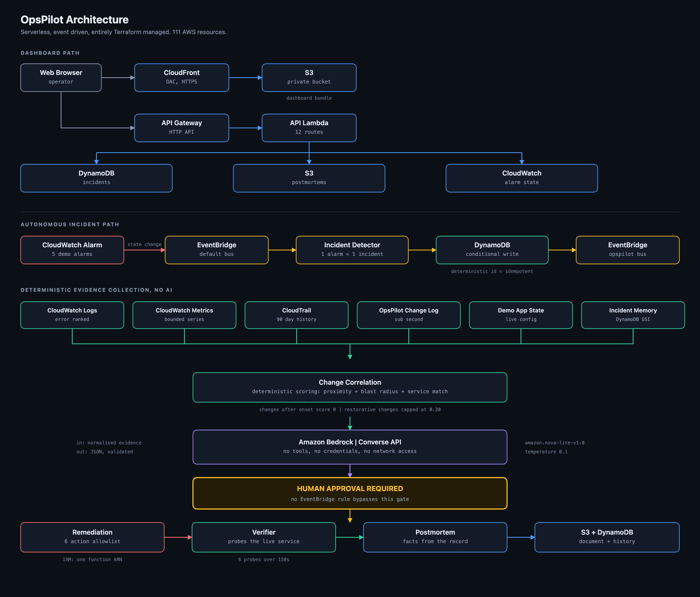
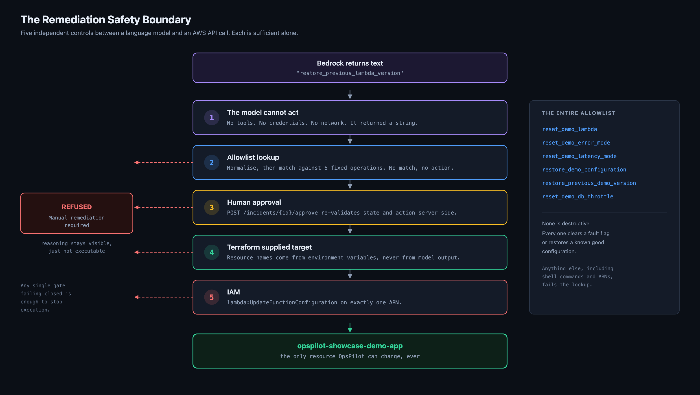

# Weekend Showcase Challenge: OpsPilot

**From incident detection to verified recovery.**

#application #challenge

---

At 03:00 an alarm fires. You open CloudWatch to find the right metric. You find the log group and scroll. You open CloudTrail, guess a time window, and read raw JSON trying to work out whether the deploy an hour ago is related. Then you decide what to do, under time pressure, with partial information. Then you watch a graph and hope. The postmortem gets written tomorrow. Usually never.

Most of that is mechanical evidence gathering, and it consumes the majority of the time to diagnosis. So I spent this weekend building the thing I wanted at 03:00.

**OpsPilot** is an autonomous AWS incident lifecycle platform. It detects incidents, investigates telemetry, correlates infrastructure changes, recommends safe remediation, verifies recovery, and writes the postmortem. The question it answers is not "summarise these logs". It is:

> What happened, why did it happen, what changed immediately beforehand, what should I do, did the fix actually work, and have I encountered this before?

Repo: **https://github.com/TanseerS/aws-builder-lab** (see `weekend-challenges/ops-pilot-2.0`)

Deploy is two commands:

```bash
cd terraform
terraform init
terraform apply
```

That is the entire installation. No console clicking, no manual resource creation, no separate build step. 111 AWS resources come up in about four minutes.

---

## What it does



Everything on that screen is read from real AWS services. There is no mock data anywhere in the project. The active incident count comes from a DynamoDB index, the alarm states come from a CloudWatch `DescribeAlarms` call, and the average MTTR is computed from actual resolution timestamps.

The panel in the middle is a Demo Lab: a small Lambda application that OpsPilot is allowed to break and repair. Clicking "Inject Lambda Error" rewrites that function's environment variables, which is a real `lambda:UpdateFunctionConfiguration` call. It lands in CloudTrail exactly the way a production deployment would. That matters, because it means change correlation is running against genuine AWS control plane activity rather than a simulation.

About ninety seconds later a CloudWatch alarm crosses its threshold, EventBridge delivers the state change, and an incident appears.



The timeline is the point of the whole product. The infrastructure change sits above the alarm, so the relationship between "what changed" and "what broke" is the first thing you see rather than something you reconstruct by hand.

Each change carries a correlation score and the reasons behind it. The fault injection scored 1.0 and is labelled `likely_contributor`. Earlier configuration changes scored 0.4 and are labelled `possible_contributor`. That scoring is arithmetic, not AI: temporal proximity to onset, blast radius of the operation, and whether the change touches the service that is failing.

Two rules in that scoring matter more than the weights. Changes that happened after incident onset score zero, because they cannot have caused it. And restorative changes such as a reset or a rollback are capped below the contributor threshold, because a change that moves a system towards health is not a plausible cause of a new failure. I only added that second rule after watching OpsPilot confidently blame its own reset for a fault that was injected immediately afterwards.

Approve the remediation and OpsPilot fixes it, then proves it fixed it.



Look at the verification block. Six probes over 150 seconds, each one a real invocation of the demo application, and each one recording the CloudWatch alarm state alongside the result:

```
+  0s  HTTP 200 · 121ms · alarm ALARM
+ 30s  HTTP 200 ·  22ms · alarm ALARM
+ 60s  HTTP 200 ·  37ms · alarm ALARM
+ 90s  HTTP 200 ·  27ms · alarm OK
+120s  HTTP 200 ·  23ms · alarm OK
+150s  HTTP 200 ·  19ms · alarm OK
```

The service was healthy from the very first probe. The alarm took another 90 seconds to catch up, because CloudWatch has to observe a full healthy evaluation period before it transitions. If I had verified against the alarm alone I would have failed a recovery that had already happened.

So the live probe decides and the alarm is recorded as corroborating evidence. The verdict says so explicitly, including the awkward part: error metrics from before the fix are still inside the metric window, and the verdict discloses that rather than quietly ignoring it or failing the verification over it.

An incident is never marked resolved because remediation returned without throwing an exception.

---

## Architecture



Everything is serverless and everything is Terraform managed. No VPC, no NAT gateway, no container, no always on compute.

**AWS services and why each one is there:**

| Service | Why |
| --- | --- |
| CloudWatch Alarms | The detection trigger. Five alarms on 60 second periods so a failure is caught in about two minutes. |
| CloudWatch Metrics | Quantitative evidence, and how recovery is measured. |
| CloudWatch Logs | Qualitative evidence. Collection is bounded and error ranked, never a whole stream. |
| EventBridge | Decouples the pipeline. Each stage emits an event, the next stage subscribes. Any stage can fail or be replayed independently. |
| Lambda | All compute. Nine functions, one responsibility each, one IAM role each. |
| DynamoDB | Incident store, change log, and the demo application's own table. Two global secondary indexes drive the dashboard and incident memory. |
| S3 | Postmortem documents, the dashboard bundle, CloudTrail logs. All encrypted, all private. |
| CloudTrail | The independent record of what changed in the account. This is what makes change correlation real rather than assumed. |
| API Gateway | HTTP API fronting the dashboard backend and the demo application. |
| Bedrock | Root cause explanation and postmortem narrative. Nothing else. |
| CloudFront | HTTPS for the dashboard with Origin Access Control, so the S3 bucket stays private. |
| IAM | Nine least privilege roles. The remediation boundary is enforced here, not only in code. |

The pipeline runs: CloudWatch alarm to EventBridge to incident detector to DynamoDB, then an internal event to the investigator, which fans out across six evidence sources, correlates changes deterministically, and only then calls Bedrock.

---

## The AI decision I care most about

The design principle is that deterministic code gathers facts and takes actions, and the model only explains.

Bedrock receives normalised evidence and returns JSON. It has no tools, no AWS credentials, and no network access. It cannot call an API, run a command, or name a resource that gets used for anything.

The reason is that the failure modes are completely different. A model that hallucinates a log line produces a wrong explanation, which is recoverable and visible to the operator. A model that can call `DeleteFunction` produces an outage. OpsPilot makes the second failure mode structurally impossible.



There are five independent controls between the model and an AWS API call, and each one is sufficient on its own. The one I would point at in a security review is the last: the remediation IAM role can call `lambda:UpdateFunctionConfiguration` on exactly one function ARN. Even if every software check above it were bypassed, AWS itself would refuse anything else.

The model produces a label, not an action. That label is normalised and looked up in a fixed table of six operations. Anything unrecognised, including shell commands, AWS CLI fragments, and resource ARNs, fails the lookup and the incident is marked as requiring manual remediation. The model's reasoning stays visible to the operator, it just is not executable.

I tested this against the API with a deliberately hostile input:

```bash
curl -X POST "$API/incidents/$ID/approve" \
  -d '{"action":"delete_all_production_functions; rm -rf /"}'

{"ok":false,"error":{"code":"action_not_recommended",
 "message":"Action 'delete_all_production_functions; rm -rf /' was not recommended for this incident"}}
```

The default model is `amazon.nova-lite-v1:0`, chosen deliberately. The hard part of this problem is evidence collection, not reasoning. Once the evidence is normalised, explaining it is well within a basic text model, and only the Converse API is used so swapping to any other Bedrock text model is a Terraform variable.

Bedrock will fail eventually, so the fallback is honest rather than invented. Throttling gets exponential backoff. Markdown fences get stripped, which the default model emits constantly. Prose wrapped around JSON gets extracted with a string aware brace matcher. Trailing commas get repaired. And if none of that works, the incident still exists, still carries deterministic evidence, still offers a safe scenario appropriate remediation, and reports confidence 0 with a summary that says plainly that automated analysis was unavailable. OpsPilot never fabricates a diagnosis.

---

## Incident memory without a vector database

When an incident is investigated, OpsPilot recalls past incidents that share a failure signature and passes them into the prompt as context.

There are no embeddings and no vector database. The signature is `affected_service|incident_type`, and recall is a DynamoDB global secondary index query. It costs nothing, it is predictable, and it is exact rather than fuzzy.

The model is told explicitly that historical incidents are context and not proof, and that it must not assume the current incident has the same root cause.

That trade off is documented in the README rather than hidden. Two incidents with the same underlying cause but different signatures will not match each other. For a failure taxonomy that is already known and discrete, an index beat an embedding.

---

## How I built it, and what actually went wrong

I wrote the shared library first, then the Lambda handlers, then Terraform, then the dashboard. Terraform validated on the first try. That was the last thing that went smoothly.

Nine real bugs surfaced only after deploying to AWS. Not one was visible from reading the code.

**The metric catalog blew Lambda's 4KB environment limit.** The first apply failed outright. I had been repeating a full dimensions map on every metric probe. The fix was a compact form with dimension references resolved at runtime.

**My idempotency was decorative.** I had written a DynamoDB conditional write with `attribute_not_exists(incident_id)` and felt good about it. Then I noticed the incident id was a random UUID, so the condition could never collide and enforced nothing. Deriving the id deterministically from `alarm_name` plus a time bucket made the conditional write a genuine atomic guard.

**One failure opened two incidents.** An unhandled crash emitted both the AWS Lambda `Errors` metric and my own `HttpErrors` metric, so two alarms fired for one fault. I moved to a most specific signal wins rule: a crash reports through AWS Lambda `Errors` only, a configuration failure reports `ConfigErrors` only, and a handled 500 reports `HttpErrors`. Emitting a generic error metric alongside a specific one is an alarm storm in miniature.

**An alarm that could never fire.** I built the DynamoDB throttling alarm on `ThrottledRequests` keyed on `TableName`. AWS publishes that metric only with a two dimension key of `TableName` plus `Operation`, so the alarm sat in `INSUFFICIENT_DATA` forever and the scenario silently never triggered. `WriteThrottleEvents` is the table level metric.

**Sparse metrics do not reset.** Even after fixing the metric name, AWS DynamoDB throttle metrics publish nothing when nothing is throttling, and CloudWatch then takes about eight minutes to apply the `notBreaching` treatment and return the alarm to OK. Until it does, a repeat injection produces no state change and therefore no incident, which makes the scenario unusable in a live demo. The alarm now watches a count the application emits on every request including zeros, and clears in under a minute.

**Least privilege caught me.** Switching the write burst to `BatchWriteItem` returned `AccessDeniedException`, because the demo role granted `PutItem` and not `BatchWriteItem`. My own structured logging surfaced it in one grep. That is the system working as intended.

**Lambda async retries tripled the error count.** Lambda retries a failed asynchronous invocation twice by default, so injected errors kept arriving for minutes after remediation and re-tripped the alarm. Setting `maximum_retry_attempts = 0` on the demo function made the error signal an honest reflection of the fault.

**OpsPilot blamed its own reset**, which is the restorative change rule I described earlier.

**A timeout budget that could lie.** The API Lambda had a 20 second timeout and called the Demo Lab controller synchronously, which could wait up to 20 seconds for a configuration update to settle. The API would have reported a failure for work that actually succeeded.

I also broke my own test twice, which is worth admitting. My smoke test polled `.status` instead of `.data.status` and reported four false failures on a system that was working correctly. Later, a resilience test used the AWS CLI's `Variables={json}` shorthand, which the CLI silently rejects, so the test concluded that Bedrock failure handling was broken when it had never actually broken Bedrock. Both times my first instinct was that the product was wrong. Both times the test was wrong.

---

## Verification

I did not want to write "it works" without evidence, so:

- 200 unit tests covering JSON parsing resilience, the allowlist, the state machine, change correlation scoring, and confidence coercion
- `terraform fmt`, `terraform validate`, and `ruff` all clean
- A destroy plan verified clean at 111 resources with no dependency cycles
- An IAM audit confirming no managed policies, no mutating wildcard resources, and exactly two roles able to modify the demo function, both scoped to one ARN
- All five failure scenarios verified individually, each producing exactly one correctly typed incident
- A 31 check end to end smoke test covering detect, investigate, correlate, diagnose, refuse a hostile action, approve, remediate, verify, generate a postmortem, and recall a similar incident

The allowlist tests are the ones I would keep if I could only keep one file. They assert that shell commands, SQL injection strings, production ARNs, and ambiguous input such as the bare word "reset" all resolve to nothing. Guessing there would be a safety failure, so refusing is the correct behaviour.

---

## What I learned across the summer

**Deploying is the test.** Nine bugs, none of them visible from code review. Terraform validating cleanly told me almost nothing about whether the system worked.

**Pick metrics that exist at the dimension you alarm on.** I lost real time to an alarm that could never fire, and it failed silently rather than loudly. Sparse metrics that stop publishing when healthy have the same shape of problem on the way back down.

**Constrain the model rather than trusting it.** The most valuable code I wrote this weekend is a lookup table with six entries. The model proposes a label, deterministic code decides whether that label means anything, and IAM decides what it can touch. This is not a limitation I worked around, it is the design.

**Say what you do not know.** Every evidence source carries an availability flag, so the dashboard can distinguish "we found no changes" from "we could not look". The verification verdict admits when the alarm has not caught up yet. The README has a Limitations section that says plainly that CloudTrail delivery is not instantaneous and that OpsPilot does not claim complete visibility into every AWS change. A showcase that oversells itself is worse than one that does less.

**Free tier discipline is a design constraint worth having.** The demo table is provisioned at 1 RCU and 1 WCU, which is both inside the free tier and low enough that a modest write burst produces genuine DynamoDB throttling. The constraint produced a better demo than an expensive setup would have.

---

## Cost and cleanup

Idle cost is a few dollars a month, dominated by five custom CloudWatch metrics. The traffic generator runs one invocation a minute, roughly 43,000 a month against a one million free tier allowance. A full investigation is a few thousand Bedrock tokens, a fraction of a cent on Nova Lite. CloudTrail is management events only, single region, write events only, expiring after 30 days, so only S3 storage is charged.

```bash
terraform destroy
```

removes all 111 resources.

One prerequisite genuinely cannot be automated: Bedrock model access is granted per account through the console and has no Terraform resource. It is documented prominently rather than hidden, and if you skip it everything still deploys and incidents still work, they just fall back to the deterministic path.

---

## Thanks

Tagging **Lewis Sawe**, whose Museum That Grows from the Creative Agent weekend was the build that made me stop thinking about agents as chatbots and start thinking about them as things that wake up, read state, do one bounded thing, and go back to sleep. OpsPilot's investigator is that same shape, pointed at CloudWatch instead of a gallery.

Repo: **https://github.com/TanseerS/aws-builder-lab**

